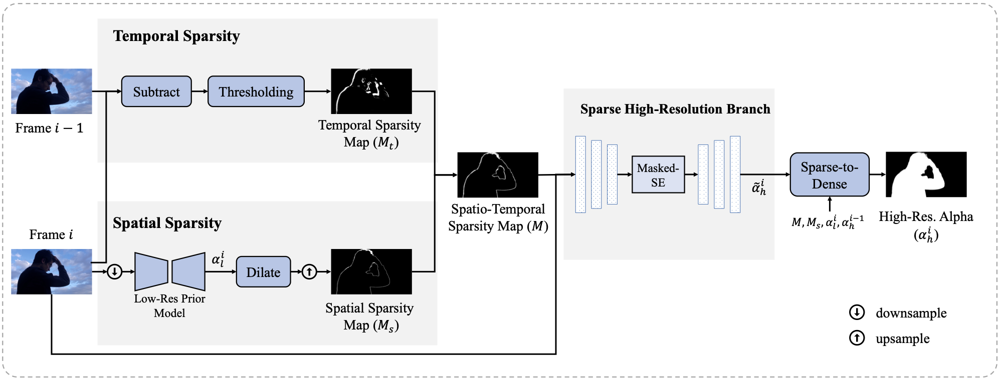

# SparseMat
Repository for *Ultrahigh Resolution Image/Video Matting with Spatio-Temporal Sparsity*, which has been accepted by CVPR2023.

### Overview

Commodity ultrahigh definition (UHD) displays are becoming more affordable which demand imaging in ultrahigh resolution (UHR). This paper proposes {\em SparseMat}, a computationally efficient approach for UHR image/video matting.  Note that it is infeasible to directly process UHR images at full resolution in one shot using existing matting algorithms without running out of memory on consumer-level computational platforms, e.g., Nvidia 1080Ti with 11G memory, while patch-based approaches can introduce unsightly artifacts due to patch partitioning. Instead, our method resorts to spatial and temporal sparsity for addressing general UHR matting. When processing videos, huge computation redundancy can be reduced by exploiting spatial and temporal sparsity. In this paper, we show how to effectively detect spatio-temporal sparsity, which serves as a gate to activate input pixels for the matting model. Under the guidance of such sparsity, our method with sparse high-resolution module (SHM) can avoid patch-based inference while memory efficient for full-resolution matte refinement. Extensive experiments demonstrate that SparseMat can effectively and efficiently generate high-quality alpha matte for UHR images and videos at the original high resolution in a single pass.

### Code

Coming soon ...
